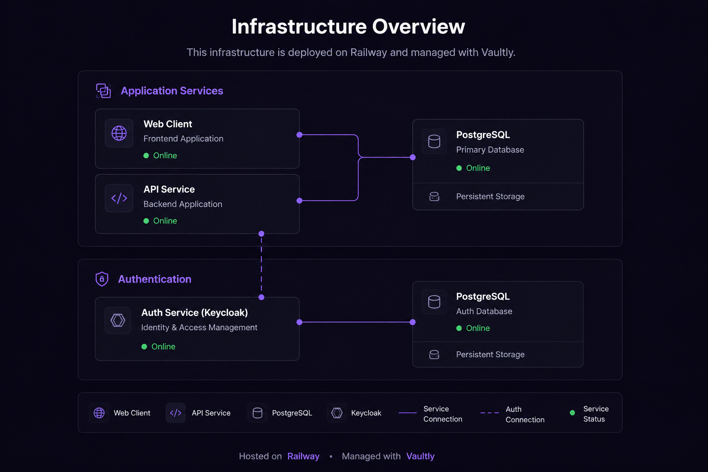

# Vaultly

Plataforma de gestión centralizada de bases de datos. Permite administrar conexiones, ejecutar y programar backups, restaurar dumps, auditar operaciones y monitorear jobs en múltiples entornos desde una única interfaz web.

---

## Stack

| Capa | Tecnología | Versión |
|------|-----------|---------|
| Runtime | Node.js | ≥ 22 |
| Package manager | pnpm workspaces | ≥ 9 |
| Lenguaje | TypeScript | ^5.8.3 |
| Backend | NestJS | ^11.0.7 |
| ORM | TypeORM | ^0.3.20 |
| Frontend | React | ^19.1.0 |
| Build tool | Vite | ^6.3.3 |
| Router | React Router | ^7.5.0 |
| Auth | Keycloak (OIDC, externo) | — |
| Storage | Cloudflare R2 (S3-compatible) | — |
| Base de datos | PostgreSQL 16 | — |
| Tiempo real | Server-Sent Events (SSE) | — |

---

## Arquitectura desplegada

Producción corre en [Railway](https://railway.com) con dos projects separados: el stack de la app y la infra de auth. Ver [docs/deployment-railway.md](docs/deployment-railway.md) para los pasos completos.



---

## Estructura del monorepo

```
vaultly-control/
│
├── apps/
│   ├── api/                     # NestJS — Monolito Modular  :3000
│   └── web/                     # React + Vite — Vertical Slice  :5173 / :80
│
├── docs/                        # Documentación técnica
│
├── docker-compose.yml      # Stack en Docker (para CI o servers self-hosted)
├── docker-compose.dev.yml  # Overrides dev (hot reload, perfil 'test' opcional)
│
├── .env                    # Variables activas (no commitear)
├── .env.example            # Plantilla — copiar a .env
│
├── pnpm-workspace.yaml
├── tsconfig.base.json
└── package.json
```

El monorepo usa **pnpm workspaces** sin Turborepo ni Nx. Workspace activo: `apps/*`.

---

## Primeros pasos

### Prerrequisitos

- Node.js ≥ 22
- pnpm ≥ 9 (`npm install -g pnpm`)
- Docker + Docker Compose

### Instalación

```bash
git clone <url-del-repo>
cd vaultly-control
pnpm install
```

### Configuración de entorno

```bash
cp apps/api/.env.example apps/api/.env
cp apps/web/.env.example apps/web/.env
# Editar ambos con los valores reales
```

Ver [docs/environment-variables.md](docs/environment-variables.md) para referencia completa.

> **Keycloak** corre en la nube. Configurar `KEYCLOAK_URL`, `KEYCLOAK_REALM` y `KEYCLOAK_CLIENT_ID` apuntando a la instancia externa.

### Levantar la DB local

```bash
pnpm docker:db
```

### Arrancar en modo desarrollo

```bash
pnpm dev
```

API disponible en `http://localhost:3000` · Frontend en `http://localhost:5173`.

### Levantar todo en Docker

```bash
pnpm docker:dev          # api + web + db con hot reload
pnpm docker:dev:test     # idem + db-test-pg (:5434) + db-test-mysql (:3306)
pnpm docker:prod         # build de producción end-to-end
```

---

## Scripts

| Comando | Descripción |
|---------|-------------|
| `pnpm dev` | API + Web en modo watch/hot-reload (Node.js nativo) |
| `pnpm build` | Compila todas las apps para producción |
| `pnpm test` | Tests de todos los workspaces |
| `pnpm lint` | Linting en todos los workspaces |
| `pnpm typecheck` | Verificación de tipos sin emitir archivos |
| `pnpm docker:dev` | Stack completo en Docker con hot reload |
| `pnpm docker:dev:test` | Idem + DBs de testing (PostgreSQL :5434, MySQL :3306) |
| `pnpm docker:db` | Solo la DB principal (para correr api/web nativos) |
| `pnpm docker:prod` | Build de producción end-to-end |

Por workspace:

```bash
pnpm --filter @vaultly-control/api dev
pnpm --filter @vaultly-control/web build
```

---

## Documentación

### Empezar

| Doc | Contenido |
|-----|-----------|
| [local-development.md](docs/local-development.md) | Setup local: Node.js vs Docker, comandos, debugging |
| [deployment-railway.md](docs/deployment-railway.md) | Deploy en Railway: services, variables, setup de Keycloak |

### Cómo funciona (dominio)

| Doc | Contenido |
|-----|-----------|
| [flow-database-management.md](docs/flow-database-management.md) | Connections: environments, permisos por engine, ciclo de vida |
| [scheduler-architecture.md](docs/scheduler-architecture.md) | Cronjobs, SchedulerRegistry, single-replica |
| [security-model.md](docs/security-model.md) | Invariantes de PROD, audit, autorización (con refs a código) |

### Arquitectura técnica

| Doc | Contenido |
|-----|-----------|
| [architecture.md](docs/architecture.md) | Módulos API, estructura web, SSE |
| [infrastructure.md](docs/infrastructure.md) | Docker Compose local, credenciales de testing |

### Referencia

| Doc | Contenido |
|-----|-----------|
| [environment-variables.md](docs/environment-variables.md) | Todas las variables con tipos y defaults |
| [database-migrations.md](docs/database-migrations.md) | TypeORM migrations: generate, run, revert |
| [conventions.md](docs/conventions.md) | Nombrado, imports, commits, TypeScript |
