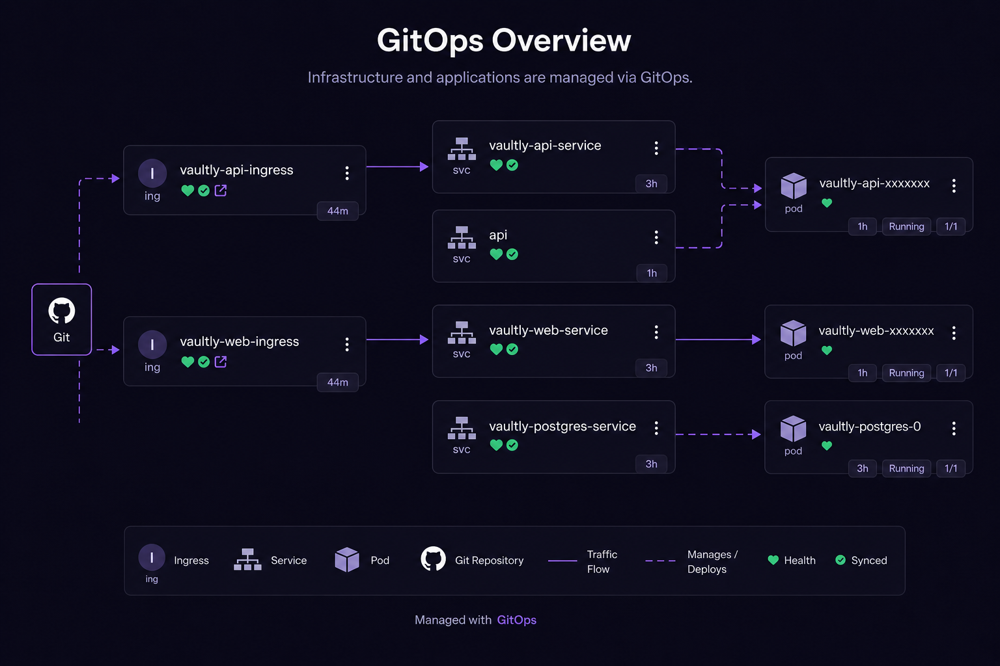

# Vaultly

> 🇪🇸 Versión en español: [README.es.md](README.es.md)

Centralized database management platform. Register database connections, run and schedule backups, restore dumps, audit operations and monitor jobs across multiple environments from a single web interface.

---

## Stack

| Layer           | Technology                    | Version |
| --------------- | ----------------------------- | ------- |
| Runtime         | Node.js                       | ≥ 22    |
| Package manager | pnpm workspaces               | ≥ 9     |
| Language        | TypeScript                    | ^5.8.3  |
| Backend         | NestJS                        | ^11.0.7 |
| ORM             | TypeORM                       | ^0.3.20 |
| Frontend        | React                         | ^19.1.0 |
| Build tool      | Vite                          | ^6.3.3  |
| Router          | React Router                  | ^7.5.0  |
| Auth            | Keycloak (OIDC, external)     | —       |
| Storage         | Cloudflare R2 (S3-compatible) | —       |
| Control DB      | **PostgreSQL 16+ (required)** | —       |
| Real-time       | Server-Sent Events (SSE)      | —       |

---

## Requirements (non-negotiable)

The **control database** — the one Vaultly uses to store its own state (registered connections, audit log, cronjobs, dump metadata) — **MUST be PostgreSQL 16 or higher**. This is hardcoded into the TypeORM configuration ([`apps/api/src/config/database.config.ts`](apps/api/src/config/database.config.ts)) and relies on Postgres-specific features (enum types, JSONB, defaults). Other engines are not supported and there is no plan to support them for the control DB.

The **managed databases** — the ones your DevOps users register to back up — currently support PostgreSQL and MySQL. See [docs/en/connecting-cloud-databases.md](docs/en/connecting-cloud-databases.md) and [docs/en/connecting-on-premise-databases.md](docs/en/connecting-on-premise-databases.md) for connectivity options, SSL handling, and on-prem patterns.

---

## Architecture — visual reference

Two example deployment topologies. **Neither is mandatory** — Vaultly runs on any platform that can host Docker containers and a PostgreSQL 16+ instance. Pick the one that matches your operational model.

### Option 1 — PaaS push-deploy (recommended for fast cloud setup)

Best when you want a **working stack in under an hour**, including Keycloak. [Railway](https://railway.com) is the documented template because it ships a pre-built Keycloak setup that drops in with minimal configuration. Same pattern applies to Fly.io, Render, or any PaaS that builds Docker images on git push.

Walkthrough: [docs/en/deployment-railway.md](docs/en/deployment-railway.md).


### Option 2 — GitOps pull-based (recommended for on-prem, air-gapped, or isolated cloud)

Best when you need to deploy into a **private network**, regulated environment, or cloud account that doesn't allow inbound webhooks. Manifests live in git, an agent (ArgoCD, Flux) inside the target cluster pulls them, and image updates flow through the same mechanism. Vaultly's web layer is designed for this: runtime config is injected via `window.APP_CONFIG` (`entrypoint.sh` writes `config.js` from container env vars before nginx starts) — no `.env` file is needed in the image.

Deployment contract (env vars, probes, sizing, scaling constraints): [docs/en/deployment-self-host.md](docs/en/deployment-self-host.md). Web config pattern: [docs/en/local-development.md](docs/en/local-development.md#web-environment-configuration).



### Decision shortcut

| Your situation | Recommended path |
|----------------|------------------|
| Evaluating Vaultly, want it running today | Railway (Option 1) |
| Small team, public cloud, fine with vendor PaaS | Railway (Option 1) |
| Regulated industry, compliance-sensitive | GitOps (Option 2) |
| On-prem DBs that can't be exposed publicly | GitOps (Option 2), Vaultly inside the private network |
| Cloud account with strict egress-only firewall | GitOps (Option 2) |
| Multi-environment, need full git audit trail of deploys | GitOps (Option 2) |

---

## Monorepo layout

```
vaultly-control/
│
├── apps/
│   ├── api/                     # NestJS — Modular Monolith  :3000
│   └── web/                     # React + Vite — Vertical Slice  :5173 / :80
│
├── docs/
│   ├── en/                      # Technical documentation (English)
│   └── es/                      # Versión en español
│
├── docker-compose.yml      # Docker stack (CI or self-hosted servers)
├── docker-compose.dev.yml  # Dev overrides (hot reload, optional 'test' profile)
│
├── .env                    # Active variables (do not commit)
├── .env.example            # Template — copy to .env
│
├── pnpm-workspace.yaml
├── tsconfig.base.json
└── package.json
```

The monorepo uses **pnpm workspaces** without Turborepo or Nx. Active workspace: `apps/*`.

---

## For DevOps — quick links

| What you need                                     | Where to look                                                                      |
| ------------------------------------------------- | ---------------------------------------------------------------------------------- |
| Run locally from scratch                          | [docs/en/local-development.md](docs/en/local-development.md)                             |
| Deploy to Railway (fast PaaS path with Keycloak template) | [docs/en/deployment-railway.md](docs/en/deployment-railway.md)                     |
| Deploy to your own infra (K8s, Nomad, Docker, etc.) | [docs/en/deployment-self-host.md](docs/en/deployment-self-host.md)                     |
| Connect to managed cloud DBs (Neon / RDS / Azure) | [docs/en/connecting-cloud-databases.md](docs/en/connecting-cloud-databases.md)           |
| Connect to on-premise DBs (SSH tunnels, VPN)      | [docs/en/connecting-on-premise-databases.md](docs/en/connecting-on-premise-databases.md) |
| Day-to-day operations / runbook                   | [docs/en/devops-runbook.md](docs/en/devops-runbook.md)                                   |
| Troubleshooting                                   | [docs/en/troubleshooting.md](docs/en/troubleshooting.md)                                 |
| Where the project is headed (driver+transport)    | [docs/en/architecture-roadmap.md](docs/en/architecture-roadmap.md)                       |

> The "For DevOps" docs above are part of an in-progress documentation push. Items marked as `STATUS: PROPOSED` describe target architecture, not current behavior — always cross-check with the source if you are about to act on them.

---

## Getting started

### Prerequisites

- Node.js ≥ 22
- pnpm ≥ 9 (`npm install -g pnpm`)
- Docker + Docker Compose
- **PostgreSQL 16+** available locally (the `pnpm docker:db` script provides one)

### Install

```bash
git clone https://github.com/Aisaac2205/vaultly-dumps
cd vaultly-control
pnpm install
```

### Configure environment

```bash
cp apps/api/.env.example apps/api/.env
cp apps/web/.env.example apps/web/.env
# Edit both with real values
```

See [docs/en/environment-variables.md](docs/en/environment-variables.md) for the full reference.

> **Keycloak** runs in the cloud. Point `KEYCLOAK_URL`, `KEYCLOAK_REALM` and `KEYCLOAK_CLIENT_ID` at the external instance.

### Start the local database

```bash
pnpm docker:db
```

### Run in development mode

```bash
pnpm dev
```

API on `http://localhost:3000` · Frontend on `http://localhost:5173`.

### Run everything in Docker

```bash
pnpm docker:dev          # api + web + db with hot reload
pnpm docker:dev:test     # idem + db-test-pg (:5434) + db-test-mysql (:3306)
pnpm docker:prod         # end-to-end production build
```

---

## Scripts

| Command                | Description                                         |
| ---------------------- | --------------------------------------------------- |
| `pnpm dev`             | API + Web in watch/hot-reload mode (native Node.js) |
| `pnpm build`           | Builds every app for production                     |
| `pnpm test`            | Runs every workspace's tests                        |
| `pnpm lint`            | Lints every workspace                               |
| `pnpm typecheck`       | Type-checks without emitting files                  |
| `pnpm docker:dev`      | Full stack in Docker with hot reload                |
| `pnpm docker:dev:test` | Idem + testing DBs (PostgreSQL :5434, MySQL :3306)  |
| `pnpm docker:db`       | Control DB only (when you run api/web natively)     |
| `pnpm docker:prod`     | End-to-end production build                         |

Per workspace:

```bash
pnpm --filter @vaultly-control/api dev
pnpm --filter @vaultly-control/web build
```

---

## Documentation

### Getting started

| Doc                                                 | Content                                             |
| --------------------------------------------------- | --------------------------------------------------- |
| [local-development.md](docs/en/local-development.md)     | Local setup: Node.js vs Docker, commands, debugging       |
| [deployment-railway.md](docs/en/deployment-railway.md)   | Railway walkthrough: services, variables, Keycloak setup  |
| [deployment-self-host.md](docs/en/deployment-self-host.md) | Platform-agnostic deployment contract for K8s/Nomad/etc. |

### How it works (domain)

| Doc                                                             | Content                                                      |
| --------------------------------------------------------------- | ------------------------------------------------------------ |
| [flow-database-management.md](docs/en/flow-database-management.md) | Connections: environments, per-engine permissions, lifecycle |
| [scheduler-architecture.md](docs/en/scheduler-architecture.md)     | Cronjobs, SchedulerRegistry, single-replica trade-off        |
| [security-model.md](docs/en/security-model.md)                     | PROD invariants, audit, authorization (with code references) |

### Operations (DevOps)

| Doc                                                                                      | Content                                              |
| ---------------------------------------------------------------------------------------- | ---------------------------------------------------- |
| [connecting-cloud-databases.md](docs/en/connecting-cloud-databases.md)                   | Managed DB setup: Neon, RDS, Supabase, Azure, GCP    |
| [connecting-on-premise-databases.md](docs/en/connecting-on-premise-databases.md)         | On-prem patterns: self-host, VPN, SSH tunnel         |
| [devops-runbook.md](docs/en/devops-runbook.md)                                           | Pre-prod checklist, monitoring, rotations, incidents |
| [troubleshooting.md](docs/en/troubleshooting.md)                                         | Symptom → cause → fix index                          |

### Technical architecture

| Doc                                                              | Content                                            |
| ---------------------------------------------------------------- | -------------------------------------------------- |
| [architecture.md](docs/en/architecture.md)                       | API modules, web structure, SSE                    |
| [infrastructure.md](docs/en/infrastructure.md)                   | Local Docker Compose, testing credentials          |
| [architecture-roadmap.md](docs/en/architecture-roadmap.md)       | Proposed driver+transport design (NOT implemented) |

### Reference

| Doc                                                       | Content                                   |
| --------------------------------------------------------- | ----------------------------------------- |
| [environment-variables.md](docs/en/environment-variables.md) | Every variable with types and defaults    |
| [database-migrations.md](docs/en/database-migrations.md)     | TypeORM migrations: generate, run, revert |
| [conventions.md](docs/en/conventions.md)                     | Naming, imports, commits, TypeScript      |
