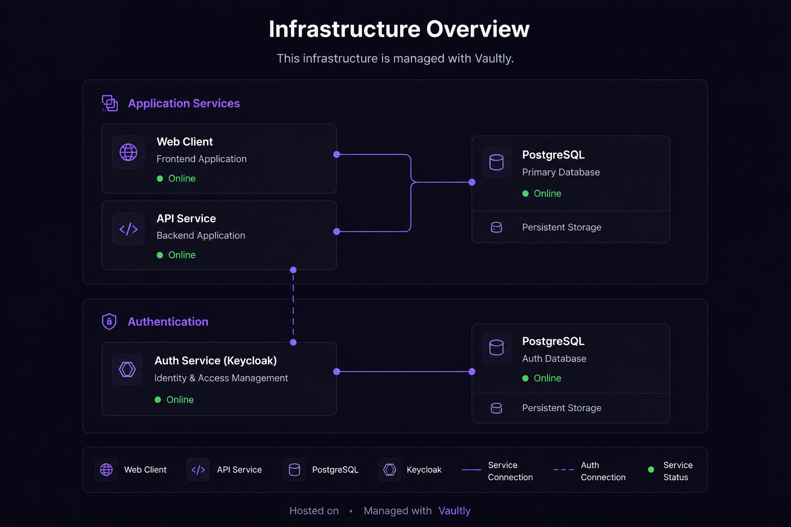

# Deployment — Railway

> 🇪🇸 Versión en español: [../es/deployment-railway.md](../es/deployment-railway.md)

> **This walkthrough is one deployment template, not the only path.** Vaultly runs on any container platform with a PostgreSQL 16+ instance. Railway is documented here because it gives you a working stack in under an hour, which is useful as a starting point or for evaluation. For Kubernetes, Fly.io, AWS ECS, or self-hosted Docker, the same variables and services apply — only the orchestration layer changes.

This walkthrough shows how to deploy Vaultly Control on [Railway](https://railway.com). Auth runs inside the API — no external auth service is needed.



---

## Project — Vaultly Dumps (app stack)

### Services

| Service | Source | Builder | Dockerfile | Public port |
|---------|--------|---------|------------|-------------|
| `vaultly-web` | GitHub repo (`main`) | Dockerfile | `apps/web/Dockerfile` | `80` |
| `vaultly-api` | GitHub repo (`main`) | Dockerfile | `apps/api/Dockerfile` | (internal) |
| `Postgres` | Railway plugin | — | — | (internal) |

> **`vaultly-api` has no public port.** The browser never talks to it directly — `vaultly-web`'s nginx proxies `/api/*` to it over Railway's private network (`vaultly-api.railway.internal`, zero-config within a project environment). Only `vaultly-web` gets a public domain.

### Common config for the two GitHub services

In **Settings → Build**:

- **Root Directory**: `/` (repo root — NOT `apps/api` or `apps/web`)
- **Builder**: Dockerfile
- **Dockerfile Path**: `apps/api/Dockerfile` or `apps/web/Dockerfile` depending on the service

> **Why Root Directory `/`**: the Dockerfiles expect the context from the monorepo root to access `pnpm-workspace.yaml` and `pnpm-lock.yaml`. If Railway drops you into `apps/api`, the build fails.

In **Settings → Networking**:

- `vaultly-web`: Generate Domain → assigns `https://<service>-production.up.railway.app`, Target Port `80`.
- `vaultly-api`: no domain, no public networking. It only needs to be reachable at `vaultly-api.railway.internal:3000`, which Railway wires up automatically the moment both services exist in the same project environment.

### Variables — `vaultly-api`

```bash
# Runtime
NODE_ENV=production
PORT=3000

# Postgres (reference variables to the plugin)
DB_HOST=${{Postgres.PGHOST}}
DB_PORT=${{Postgres.PGPORT}}
DB_NAME=${{Postgres.PGDATABASE}}
DB_USER=${{Postgres.PGUSER}}
DB_PASSWORD=${{Postgres.PGPASSWORD}}

# Better Auth
BETTER_AUTH_SECRET=<64-char-hex-string>
# The web's domain, not the api's — the api has none. This is the address
# the BROWSER uses to reach /api/auth/*, which nginx proxies through.
BETTER_AUTH_URL=https://${{vaultly-web.RAILWAY_PUBLIC_DOMAIN}}
BETTER_AUTH_ADMIN_EMAIL=admin@example.com
BETTER_AUTH_ADMIN_PASSWORD=<strong-password>

# Required by env validation and kept for any deployment that doesn't use
# the nginx proxy (e.g. local dev talking to the api directly). With the
# proxy in place the browser never reaches the api cross-origin, so this
# has no effect on real traffic here — it's inert, not load-bearing.
CORS_ORIGIN=https://${{vaultly-web.RAILWAY_PUBLIC_DOMAIN}}

# Cloudflare R2 (dump storage)
R2_ACCOUNT_ID=<32-char hex from Cloudflare Dashboard>
R2_ACCESS_KEY_ID=<from an R2 API Token>
R2_SECRET_ACCESS_KEY=<from the same token, only shown at creation>
R2_BUCKET_NAME=vaultly-dumps
```

> **Reference variables**: `${{Postgres.PGHOST}}` and `${{vaultly-web.RAILWAY_PUBLIC_DOMAIN}}` are automatically resolved by Railway to the actual hostname/domain of the referenced resource. They update on their own if you rename services.

> **R2_ACCOUNT_ID ≠ R2_ACCESS_KEY_ID**: the first one is the Cloudflare Account ID (visible in the dashboard, top right). The second one is generated by Cloudflare when you create an R2 API Token. Both are different 32-char hex strings. Mixing them up produces a cryptic `SSL alert 40`, not a clear error.

### Variables — `vaultly-web`

`VITE_*` variables must be **available at build time** because Vite bakes them into the static bundle. Railway passes them as build args automatically when they are in the service's Variables tab.

```bash
# Left unset (or empty) on purpose: the SPA calls a relative /api/*,
# and nginx proxies it to vaultly-api over the private network.
# VITE_API_URL=
VITE_APP_BASE_URL=https://${{RAILWAY_PUBLIC_DOMAIN}}

# Read at container start by templates/default.conf.template — NOT a
# VITE_* var, so it's a plain runtime Service Variable, not a build arg.
#
# Use the reference variable, not a hand-typed hostname: Railway's
# private DNS name for a service is NOT reliably <service-name>.railway.internal
# in every project — some environments carry an older, differently-named
# private domain. ${{vaultly-api.RAILWAY_PRIVATE_DOMAIN}} always resolves
# to whatever that service's actual private domain really is.
API_UPSTREAM=${{vaultly-api.RAILWAY_PRIVATE_DOMAIN}}:3000
```

### Creation order

1. Add the **Postgres** plugin to the project.
2. Create the **vaultly-api** service, connect it to the repo, configure variables. Do not generate a domain for it.
3. Create the **vaultly-web** service, connect it to the repo, configure variables (including `API_UPSTREAM` pointing at `vaultly-api.railway.internal:3000`), generate its domain.
4. Go back to `vaultly-api` and set `BETTER_AUTH_URL` and `CORS_ORIGIN` to the web's domain, now that it exists.


> **Better Auth runs inside the API — no external auth service needed.** The API handles all auth at `/api/auth/*`. Users and sessions are stored in the same PostgreSQL instance as the rest of Vaultly's data.

---

## Common gotchas

| Symptom | Real cause | Fix |
|---------|------------|-----|
| nginx web returns 404 on `/` | Railway target port ≠ Dockerfile port | Settings → Networking → set target port to `80` |
| `/api/*` returns `502 Bad Gateway`, no crash on boot | `API_UPSTREAM` isn't set, or `vaultly-api` doesn't exist yet in this environment | Set `API_UPSTREAM=vaultly-api.railway.internal:3000` on `vaultly-web` and redeploy `vaultly-web` once `vaultly-api` is up. This used to crash nginx at container start (`host not found in upstream`) and force dropping the proxy entirely — it no longer does, since the upstream now resolves per-request instead of at config load (see `apps/web/templates/default.conf.template`) |
| `EPROTO ... SSL alert 40` from the api | `R2_ACCOUNT_ID` misconfigured → non-existent endpoint | Confirm the account ID in the Cloudflare Dashboard, don't confuse it with the access key |
| SPA loads with empty strings in URLs | `VITE_*` variables did not reach the build | Confirm they are Service Variables (not Shared) and trigger a redeploy |
| `flag '--mount=type=cache,...' is missing the cacheKey prefix` | Railway's BuildKit requires `id=s/<service>-...` | Remove the cache mounts — Railway has its own layer cache |

## Releases

The versioning flow lives in `.github/workflows/ci.yml` + `.releaserc.json`. Every push to `main` with a conventional commit fires semantic-release: it computes the version, generates the changelog, creates a tag and a GitHub Release.

Railway redeploys automatically on every push to `main` (configurable per service in Settings → Service → Auto-deploy).
