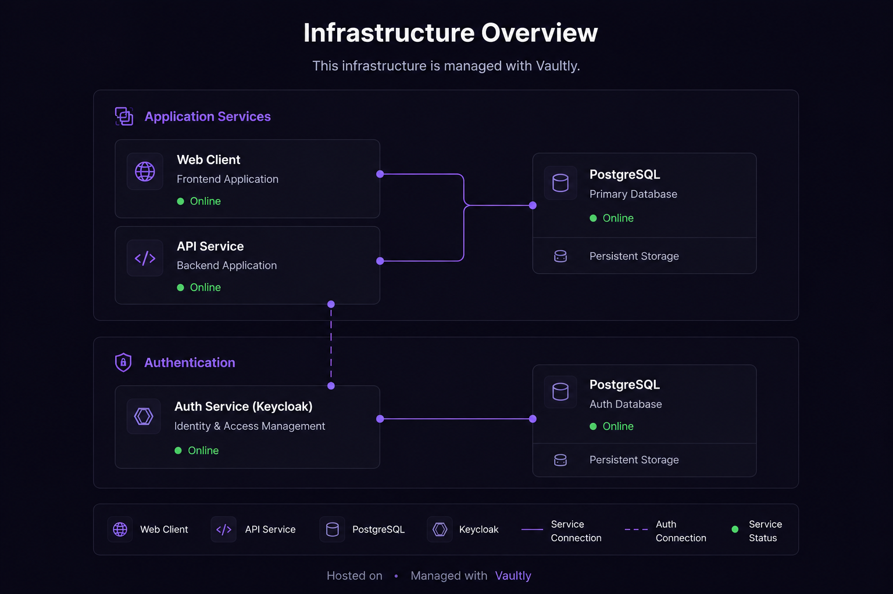

# Deployment — Railway

> 🇬🇧 English version: [../en/deployment-railway.md](../en/deployment-railway.md)

> **Esta guía es un template de deploy, no el único camino.** Vaultly corre en cualquier plataforma de contenedores con una instancia de PostgreSQL 16+. Railway está documentado acá porque te da un stack funcional (app + Keycloak) en menos de una hora, lo cual es útil como punto de partida o para evaluar. Para Kubernetes, Fly.io, AWS ECS, o Docker self-hosted, aplican las mismas variables y servicios — solo cambia la capa de orquestación.

Esta guía muestra cómo deployar Vaultly Control en [Railway](https://railway.com) con dos projects separados: el stack de la app (web + api + db) y la infraestructura de auth (Keycloak + su db).



## Por qué dos projects separados

Keycloak es **infra compartida**: gestiona identidad para Vaultly hoy y potencialmente para otros productos mañana. Aislarlo en su propio Railway project significa:

- Su ciclo de deploy es independiente del API/web.
- Su Postgres no se mezcla con el de Vaultly.
- Podés rotarle credenciales, escalar plan, o migrar a otro proveedor sin tocar el stack de la app.

Si más adelante Keycloak se mueve a un cluster dedicado, solo cambia el `KEYCLOAK_URL` del API y el `VITE_KEYCLOAK_URL` del web.

---

## Project 1 — Vaultly Dumps (app stack)

### Services

| Service | Origen | Builder | Dockerfile | Puerto público |
|---------|--------|---------|------------|----------------|
| `vaultly-web` | GitHub repo (`main`) | Dockerfile | `apps/web/Dockerfile` | `80` |
| `vaultly-api` | GitHub repo (`main`) | Dockerfile | `apps/api/Dockerfile` | `3000` |
| `Postgres` | Plugin Railway | — | — | (interno) |

### Config común para los dos services GitHub

En **Settings → Build**:

- **Root Directory**: `/` (raíz del repo — NO `apps/api` ni `apps/web`)
- **Builder**: Dockerfile
- **Dockerfile Path**: `apps/api/Dockerfile` o `apps/web/Dockerfile` según el service

> **Por qué Root Directory `/`**: los Dockerfiles esperan el contexto desde la raíz del monorepo para acceder a `pnpm-workspace.yaml` y `pnpm-lock.yaml`. Si Railway te ubica en `apps/api`, el build falla.

En **Settings → Networking**:

- Generate Domain → asigna `https://<service>-production.up.railway.app`
- Target Port: `80` para web, `3000` para api

### Variables — `vaultly-api`

```bash
# Runtime
NODE_ENV=production
PORT=3000

# Postgres (reference variables al plugin)
DB_HOST=${{Postgres.PGHOST}}
DB_PORT=${{Postgres.PGPORT}}
DB_NAME=${{Postgres.PGDATABASE}}
DB_USER=${{Postgres.PGUSER}}
DB_PASSWORD=${{Postgres.PGPASSWORD}}

# Keycloak (apunta al project de auth)
KEYCLOAK_URL=https://keycloak-production-xxxx.up.railway.app
KEYCLOAK_REALM=Vaultly
KEYCLOAK_CLIENT_ID=vaultly-api

# CORS — permite al web hablarle al api
CORS_ORIGIN=https://${{vaultly-web.RAILWAY_PUBLIC_DOMAIN}}

# Cloudflare R2 (storage de dumps)
R2_ACCOUNT_ID=<32-char hex de Cloudflare Dashboard>
R2_ACCESS_KEY_ID=<de un R2 API Token>
R2_SECRET_ACCESS_KEY=<del mismo token, solo se muestra al crear>
R2_BUCKET_NAME=vaultly-dumps
```

> **Reference variables**: `${{Postgres.PGHOST}}` y `${{vaultly-web.RAILWAY_PUBLIC_DOMAIN}}` son resueltas automáticamente por Railway al hostname/dominio real del recurso referenciado. Cambian solas si renombrás services.

> **R2_ACCOUNT_ID ≠ R2_ACCESS_KEY_ID**: el primero es el Cloudflare Account ID (visible en el dashboard, arriba a la derecha). El segundo lo genera Cloudflare al crear un R2 API Token. Son strings hex de 32 chars distintos. Confundirlos produce `SSL alert 40` críptico, no un error claro.

### Variables — `vaultly-web`

Las `VITE_*` deben estar **disponibles en build time** porque Vite las hornea en el bundle. Railway las pasa como build args automáticamente cuando están en la pestaña Variables del service.

```bash
VITE_API_URL=https://${{vaultly-api.RAILWAY_PUBLIC_DOMAIN}}
VITE_KEYCLOAK_URL=https://keycloak-production-xxxx.up.railway.app
VITE_KEYCLOAK_REALM=Vaultly
VITE_KEYCLOAK_CLIENT_ID=vaultly-web
VITE_APP_BASE_URL=https://${{RAILWAY_PUBLIC_DOMAIN}}
```

### Orden de creación

1. Agregar el plugin **Postgres** al project.
2. Crear service **vaultly-api**, conectarlo al repo, configurar variables, generar dominio.
3. Crear service **vaultly-web**, conectarlo al repo, configurar variables, generar dominio.
4. Volver al `vaultly-api` y agregar `CORS_ORIGIN` apuntando al dominio del web.

---

## Project 2 — Keycloack Login Vaultly Control (auth)

### Services

| Service | Origen | Imagen |
|---------|--------|--------|
| `Keycloak` | Imagen Docker | `quay.io/keycloak/keycloak:latest` (o pinneada) |
| `Postgres` | Plugin Railway | — |

### Variables — `Keycloak`

```bash
KEYCLOAK_ADMIN=admin
KEYCLOAK_ADMIN_PASSWORD=<password fuerte, generá uno y guardalo>

KC_DB=postgres
KC_DB_URL=jdbc:postgresql://${{Postgres.PGHOST}}:${{Postgres.PGPORT}}/${{Postgres.PGDATABASE}}
KC_DB_USERNAME=${{Postgres.PGUSER}}
KC_DB_PASSWORD=${{Postgres.PGPASSWORD}}

KC_HOSTNAME=keycloak-production-xxxx.up.railway.app
KC_PROXY=edge
KC_HTTP_ENABLED=true
```

### Start command

```bash
/opt/keycloak/bin/kc.sh start --optimized
```

Generar dominio público con Target Port `8080`.

---

## Configuración del realm y clientes en Keycloak

Una vez Keycloak está arriba, andá a `https://<keycloak-dominio>/admin` y logueá con las credenciales admin.

### Crear el realm

1. Dropdown del realm (arriba izquierda) → **Create realm**.
2. Name: `Vaultly` (case-sensitive — debe coincidir EXACTAMENTE con `KEYCLOAK_REALM` en api/web).
3. Create.

### Crear cliente `vaultly-web` (SPA, público)

1. **Clients → Create client**
2. **Client type**: OpenID Connect
3. **Client ID**: `vaultly-web`
4. Next → **Capability config**:
   - Client authentication: **OFF** (es un cliente público — SPA sin secret)
   - Authentication flow: marcar **Standard flow** y **Direct access grants**
5. Next → **Login settings**:

| Campo | Valor |
|-------|-------|
| **Root URL** | `https://vaultly-dumps.up.railway.app` |
| **Home URL** | `https://vaultly-dumps.up.railway.app` |
| **Valid redirect URIs** | `https://vaultly-dumps.up.railway.app/*` |
| **Valid post logout redirect URIs** | `https://vaultly-dumps.up.railway.app/*` |
| **Web origins** | `https://vaultly-dumps.up.railway.app` (sin `/*`) |

6. Save.

**Verificación crítica**: en **Advanced → Proof Key for Code Exchange Code Challenge Method** debe estar en `S256`. keycloak-js manda PKCE por default; si Keycloak no lo espera, el login falla con 400.

### Crear cliente `vaultly-api` (recurso, valida JWT)

1. **Clients → Create client**
2. **Client type**: OpenID Connect
3. **Client ID**: `vaultly-api`
4. Next → **Capability config**:
   - Client authentication: depende — si el API solo valida JWT firmados por Keycloak (lo más común), podés dejarlo **OFF**.
   - Authentication flow: dejar solo **Standard flow** si necesitás token introspection; sino desmarcá todo.
5. Save.

El API valida tokens contra el JWKS de Keycloak (`<KEYCLOAK_URL>/realms/Vaultly/protocol/openid-connect/certs`). No necesita secret si los tokens vienen firmados RS256.

---

## Gotchas comunes

| Síntoma | Causa real | Fix |
|---------|------------|-----|
| nginx en web devuelve 404 en `/` | Target port en Railway ≠ puerto del Dockerfile | Settings → Networking → cambiar target port a `80` |
| `host not found in upstream` en logs de nginx | nginx.conf hardcodea un hostname que no existe en Railway | Sacar el `proxy_pass`; el web habla directo al dominio público del api |
| `EPROTO ... SSL alert 40` desde api | `R2_ACCOUNT_ID` mal seteado → endpoint inexistente | Confirmar account ID en Cloudflare Dashboard, no confundir con access key |
| Keycloak login devuelve 400 Bad Request | `redirect_uri` no whitelisted en el cliente | Agregar el dominio del web a Valid Redirect URIs **con `/*`** |
| SPA carga con strings vacíos en URLs | Variables `VITE_*` no llegaron al build | Confirmar que están como Service Variables (no Shared) y disparar redeploy |
| `flag '--mount=type=cache,...' is missing the cacheKey prefix` | BuildKit de Railway exige `id=s/<service>-...` | Sacar los cache mounts — Railway tiene layer cache propio |

## Releases

El flujo de versionado está en `.github/workflows/ci.yml` + `.releaserc.json`. Cada push a `main` con commit convencional dispara semantic-release: calcula la versión, genera changelog, crea tag y GitHub Release.

Railway redeploya automáticamente en cada push a `main` (configurable per service en Settings → Service → Auto-deploy).
